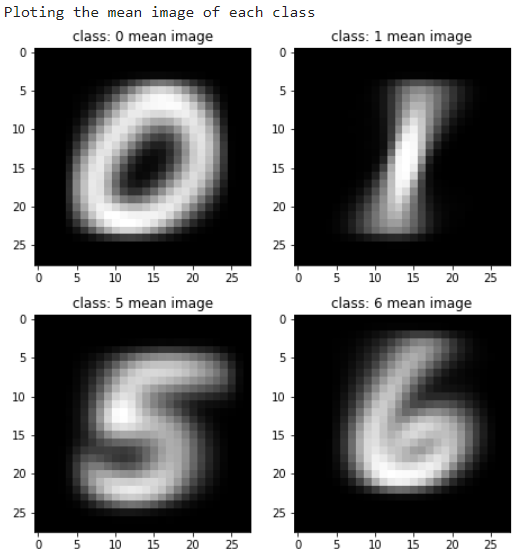
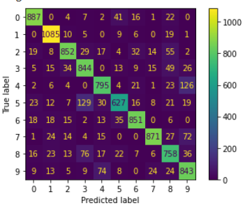
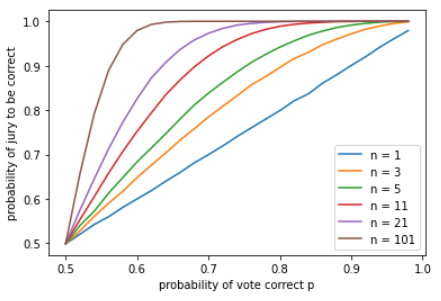
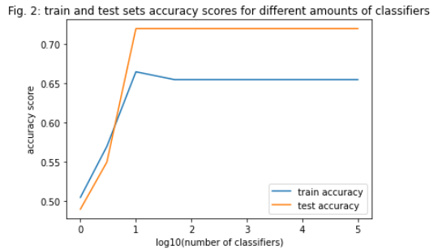
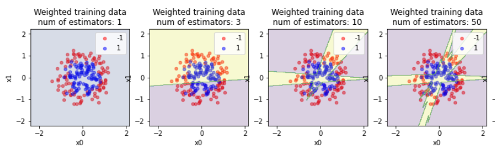
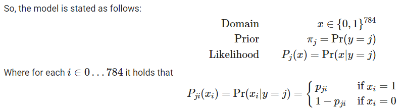

# Machine-Learning

This repository contains the tasks created as part of the Machine Learning course at the Ben-Gurion University of the Negev. 
Learning systems can be used in many different ways in information systems. They can help to find rules of behavior for a given environment, aid the user in finding an explanation for a particular phenomenon, and be used for predicting and analyzing data in any given domain. 

In this course, we studied various neural networks, genetic algorithms, and vector machines. The course reviews different families of computational learning algorithms such as Decision Trees, Ensemble methods (Random Forest, GBM, AdaBoost), SVM, Regression methods (Logistics Regression, Lasso), simple Neural Networks (feed-forward neural network), and advanced and Deep Neural Networks (CNN, RNN). Additional important principles in computational learning were studied such as Maximum Likelihood Estimation, Empirical Risk, Expectation maximization, Regularization methods, avoiding Over-fitting, Metrics, statistical tests for performance evaluation, and optimization methods for hyper-parameters.  

---
## Assignments

  
  
   
  
  
  

[Assignment 1](Assignments/NB_exercise.ipynb) - Classifying Digits (MNIST dataset) using Bernoulli Naive Bayes (Generative model). Classifing Text Documents using Multinomial Naive Bayes. Developing Naive Bayes classifier and comparing it to the scikit learn built in version.

[Assignment 2](Assignments/Ex2_Ensemble.ipynb) - AdaBoost Classifier, Condorcet's Jury Theorem (1785) - As number of jury members grows,  n→∞  , the jury majority becomes correct  Pr(correct)→1 

[Assignment 3](Assignments/Ex3.ipynb) - Models comparison - Linear SVM, Random Forest Classifier, Fully Connected Feed-Forward Neural Networks. Encoding and Normalizing, 5-fold Cross-Validation and Grid Search, Over and Under Sampling. 

---
## [Lectures_Code](Lectures_Code/)

